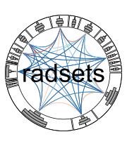

<!-- README.md is generated from README.Rmd. Please edit that file -->

```{r setup, include=FALSE}
library(radsets)
library(tidyverse)
library(knitr)
local({
  hook_plot = knit_hooks$get('plot')
  knit_hooks$set(plot = function(x, options) {
    x = paste(x, collapse = '.')
    if (!grepl('\\.svg', x)) return(hook_plot(x, options))
    # read the content of the svg image and write it out without <?xml ... ?>
    paste0('')
  })
})
```

```{r, echo = FALSE}
knitr::opts_chunk$set(
  collapse = TRUE,
  echo = FALSE, 
  eval= TRUE,
  message = FALSE, 
  warning = FALSE,
  comment = "#>",
  fig.path = "man/figures/README-"
)
```

# radsets 

[](https://www.tidyverse.org/lifecycle/#experimental)
[](https://travis-ci.org/natbprice/radsets)
[](https://codecov.io/github/natbprice/radsets?branch=master)
[](http://creativecommons.org/publicdomain/zero/1.0/)

**Package Website:** https://natbprice.github.io/radsets/

**Source Code:** https://github.com/natbprice/radsets

### Problem
The **radsets** package is a solution to the problem of how to visualize large overlapping sets. In particular, when analyzing data with many overlapping sets it is difficult to draw insight from a Venn diagram. Moreover, it may be impossible to draw a Venn diagram that accurately reflects the size of set intersections.

The solution implemented in the **radsets** package is a based on Radial Sets diagrams (see references). Radial Sets diagrams are an interactive, network-based visualization for the analysis of ovarlapping sets.

### MovieLens Example
The [MovieLens dataset](https://grouplens.org/datasets/movielens/20m/) [@harper2016movielens] includes 
19 genre attributes for 27,000 movies.

#### Radial Sets Diagram
A Radial Sets diagram created with the **radsets** package is shown below. 

The width of the links indicate the percent overlap (normalized by union) between each movie genre. The link color indicates the relative difference between the observed overlap and the expected overlap assuming marginal independence. The link color palette is diverging blue to red with red indicating overlaps that are larger than expected. 

The size of the sections on the circumference are drawn to scale based on the size of each set (i.e., the number of items in each set regardless of overlap). However, since the sets overlap the section sizes can not be interpreted as a donut chart or pie chart. The set locations on the circumference have been optimized to place similar sets closer together, thereby minimizing length of thickest links.

The bars in each sector indicate the number of items unique to each set, shared with one other set, shared with two other sets, or shared with three or more other sets. 


```{r examplePlot, dev = 'svg', fig.width = 10, fig.height = 10}
# Load sample data
data("movieSets")

# Define set names (user specified)
setNames <- movieSets %>%
  select(Action:Western) %>%
  colnames()

# Define ID column (user specified)
idName <- "movieId"

# Define max degree (user specified)
maxDegree <- 4

# Calculate set sizes
setSizes <-
  getSetSizes(movieSets, setNames)

# Calculate set sizes by degree
setSizesByDegree <-
  getSetSizesByDegree(movieSets, setNames, idName)

# Calculate edge data
setIntersections <-
  getSetIntersections(movieSets, setNames, idName)

# Optimize link order
optOrder <- optimizeLinkOrder(setSizes,
                              setSizesByDegree,
                              setIntersections,
                              linkThickness = "prop")

# Create plot
buildRadialSetsPlot(
  setSizes,
  setSizesByDegree,
  setIntersections,
  linkThickness = "prop",
  linkColor = "prop.relError",
  linkColorPal = "RdBu",
  reverseLinkPal = T,
  setOrder = optOrder[c(14:19,1:13)],
  colorScaleLim = c(-1,1),
  colorScaleMapFun = "squish",
  edgeWidthRange = c(1,8),
  sectorColor = "white"
)
```

In the diagram below, we focus on the crime genre. The links are now directional originating from the crime set and link thickness indicates the percent of crime movies that belong to the other genres.


```{r examplePlot2, dev = 'svg', fig.width = 10, fig.height = 10}

buildRadialSetsPlot(
  setSizes,
  setSizesByDegree,
  setIntersections,
  linkThickness = "prop",
  linkColor = "prop.relError",
  linkColorPal = "RdBu",
  reverseLinkPal = T,
  setOrder = optOrder[c(14:19,1:13)],
  colorScaleLim = c(-1,1),
  colorScaleMapFun = "squish",
  edgeWidthRange = c(1,8),
  sectorColor = "white",
  focusSets = "Crime"
)
```

#### Venn Euler Diagram
Radial sets are useful for visualizing relationships among variables which have many features in common. When the number of variables is small, simple venn diagrams can be useful. However, when the number of pairwise interactions is high, identifying patterns may be too difficult using simple visualizations. Moreover, it may not be possible to draw a venn diagam that accurately represents the overlap between sets. Here we use the [venneuler](https://cran.r-project.org/package=venneuler) package to illustrate the problem with using Venn diagrams when we are interested in many overlapping sets.


```{r simpleVennDiag, dev = 'svg'}

library(venneuler)

m <- movieSets %>% 
  select(movieId, setNames) %>% 
  select(-movieId) %>% 
  select("Drama", "Romance", "Comedy")
v <- venneuler::venneuler(m)
plot(v)

```


```{r complexVennDiag, dev = 'svg', fig.width = 7, fig.height = 7}

m <- movieSets %>% 
  select(movieId, setNames) %>% 
  select(-movieId)
v <- venneuler::venneuler(m)
plot(v)
```

## Acknowledgements
Radial Sets diagrams were originally proposed by [@alsallakh2013radial]. The __radsets__ package is unaffiliated with these researchers and the visualizations produced differ slightly from the original design.

This software is preliminary or provisional and is subject to revision. It is being provided to meet the need for timely best science. The software has not received final approval by the U.S. Geological Survey (USGS). No warranty, expressed or implied, is made by the USGS or the U.S. Government as to the functionality of the software and related material nor shall pthe fact of release constitute any such warranty. The software is provided on the condition that neither the USGS nor the U.S. Government shall be held liable for any damages resulting from the authorized or unauthorized use of the software.

## References

<!-- Alsallakh, B., Aigner, W., Miksch, S., & Hauser, H. (2013). Radial sets: Interactive visual analysis of large overlapping sets. IEEE Transactions on Visualization and Computer Graphics, 19(12), 2496–2505. Retrieved from http://ieeexplore.ieee.org/abstract/document/6634104/ -->
