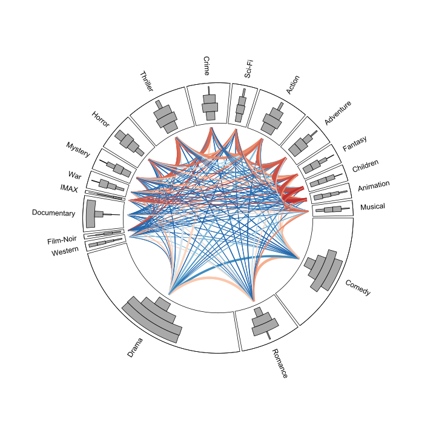
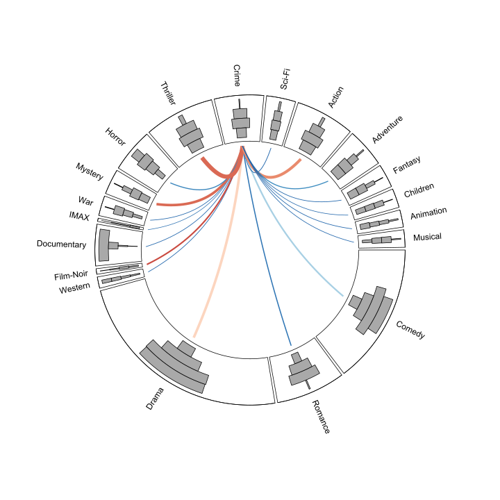

<!-- README.md is generated from README.Rmd. Please edit that file -->

### The Problem

The **radsets** package is a solution to the problem of how to visualize
large overlapping sets. In particular, when analyzing data with many
overlapping sets it is difficult to draw insight from a Venn diagram.
Moreover, it may be impossible to draw a Venn diagram that accurately
reflects the size of set intersections.

The solution implemented in the **radsets** package is a based on Radial
Sets diagrams (see references). Radial Sets diagrams are an interactive,
network-based visualization for the analysis of ovarlapping sets.

### MovieLens Example

The [MovieLens dataset](https://grouplens.org/datasets/movielens/20m/)
includes 19 genre attributes for 27,000 movies.

#### Radial Sets Diagram

A Radial Sets diagram created with the **radsets** package is shown
below.

The width of the links indicate the percent overlap (normalized by
union) between each movie genre. The link color indicates the relative
difference between the observed overlap and the expected overlap
assuming marginal independence. The link color palette is diverging blue
to red with red indicating overlaps that are larger than expected.

The size of the sections on the circumference are drawn to scale based
on the size of each set (i.e., the number of items in each set
regardless of overlap). However, since the sets overlap the section
sizes can not be interpreted as a donut chart or pie chart. The set
locations on the circumference have been optimized to place similar sets
closer together, thereby minimizing length of thickest links.

The bars in each sector indicate the number of items unique to each set,
shared with one other set, shared with two other sets, or shared with
three or more other sets.

In the diagram below, we focus on the crime genre. The links are now
directional originating from the crime set and link thickness indicates
the percent of crime movies that belong to the other genres.

#### Venn Euler Diagram

Radial sets are useful for visualizing relationships among variables
which have many features in common. When the number of variables is
small, simple venn diagrams can be useful. However, when the number of
pairwise interactions is high, identifying patterns may be too difficult
using simple visualizations. Moreover, it may not be possible to draw a
venn diagam that accurately represents the overlap between sets. Here we
use the [venneuler](https://cran.r-project.org/package=venneuler)
package to illustrate the problem with using Venn diagrams when we are
interested in many overlapping sets.

## References

Radial Sets diagrams were originally proposed by Alsallakh, Aigner,
Miksch, and Hauser. The **radsets** package is unaffiliated with these
researchers and the visualizations produced differ slightly from the
original design.

Alsallakh, B., Aigner, W., Miksch, S., & Hauser, H. (2013). Radial sets:
Interactive visual analysis of large overlapping sets. IEEE Transactions
on Visualization and Computer Graphics, 19(12), 2496–2505. Retrieved
from <http://ieeexplore.ieee.org/abstract/document/6634104/>
